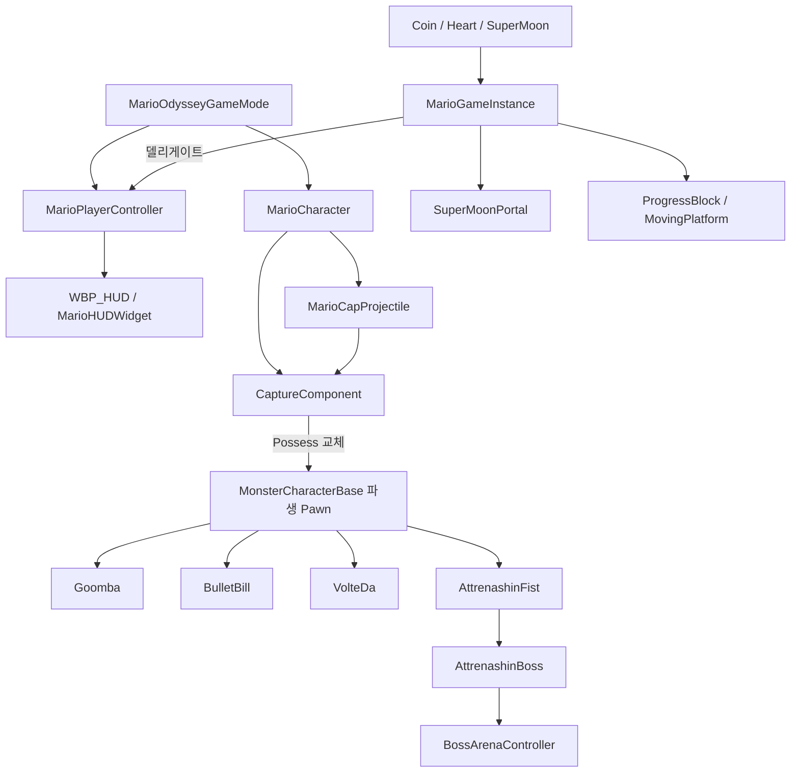

# 00. 프로젝트 전체 개요

## 1. 프로젝트 성격

MarioOdyssey는 Unreal Engine 5.4 기반의 3D 액션 플랫포머 프로토타입이다. 원작의 핵심 감각을 다음 세 축으로 재구성했다.

1. 마리오의 연계 이동: 3단 점프, 멀리뛰기, 백플립, 구르기, 엉덩방아, 다이브, 벽 슬라이드/벽차기
2. 캐피 기반 캡처: 모자를 맞힌 몬스터를 플레이어 Pawn으로 전환하고 고유 능력을 사용
3. 탐색과 공략의 결합: 슈퍼문 수집으로 월드 요소와 포탈을 개방하고, 캡처 능력으로 보스 기믹을 해결

## 2. 실행 구성

| 항목 | 값 |
|---|---|
| 엔진 | Unreal Engine 5.4 |
| 모듈 | `MarioOdyssey` 단일 Runtime 모듈 |
| 기본 맵 | `/Game/Maps/Map` |
| 기본 게임 모드 | `AMarioOdysseyGameMode` |
| 기본 Pawn | `/Game/_BP/Character/Mario/BP_Mario`, 실패 시 `AMarioCharacter` |
| PlayerController | `AMarioPlayerController` |
| GameInstance | `UMarioGameInstance` |
| 패키징 맵 | `/Game/Maps/Map`, `/Game/Maps/Arena` |
| 그래픽 | DX12, SM5/SM6, Lumen GI/Reflection, Virtual Shadow Map |

`AMarioOdysseyGameMode`는 생성자에서 `BP_Mario`를 로드하고 HUD용 PlayerController를 지정한다. 진행도와 HUD 데이터는 Pawn이 바뀌어도 유지돼야 하므로 Character가 아니라 GameInstance에 둔다.

## 3. 런타임 시스템 지도

## 4. 주요 런타임 흐름

### 게임 시작

1. `Map` 로드
2. GameMode가 `BP_Mario`와 `AMarioPlayerController`를 생성
3. PlayerController가 `WBP_HUD`를 만들고 GameInstance 델리게이트에 바인딩
4. `AMarioStartFlowActor`가 HUD를 숨기고 조작과 월드 BGM을 잠금
5. 시작 화면에서 C 입력을 받으면 시작 음원 페이드 아웃
6. `LS_Start` 계열 Level Sequence 재생
7. 컷신 종료 후 HUD, 입력, 월드 BGM 복구

### 일반 플레이

1. `AMarioCharacter`가 Enhanced Input 액션을 처리
2. 캐피 투척이 몬스터와 충돌하면 `ICapturableInterface`를 통해 캡처 가능 여부 확인
3. 캡처 성공 시 PlayerController가 몬스터 Pawn을 Possess하되 ViewTarget은 마리오로 유지
4. 수집물 획득 시 GameInstance의 HP/코인/슈퍼문 값과 델리게이트 갱신
5. HUD, 포탈, 진행 블록, 이동 플랫폼이 같은 이벤트를 구독해 반응

### 아레나와 보스

1. 슈퍼문 조건을 충족한 포탈이 활성화
2. 포탈이 다음 맵 스폰 Transform과 페이드 정보를 GameInstance에 저장하고 `Arena`를 OpenLevel
3. Arena 인트로는 세션당 1회 재생
4. 보스 트리거 진입 후 지연 → 조우 컷신 → 실제 보스 스폰
5. 얼음 타일에 주먹을 내려치게 해 기절 → 주먹 캡처 → 머리 타격
6. 머리 누적 3회 타격 시 아레나 컨트롤러가 전투를 종료하고 잔여 액터를 정리

## 5. 소스 구조와 책임

| 영역 | 핵심 클래스 | 책임 |
|---|---|---|
| Root | `AMarioCharacter` | 이동, 액션, 카메라, HP, 사망, 체크포인트 |
| Capture | `UCaptureComponent`, `ICapturableInterface` | 캡처 계약, Possess 전환, 해제 위치 계산 |
| Character/Monster | `AMonsterCharacterBase`와 파생 클래스 | AI와 캡처 조작의 공통/개별 행동 |
| Character/Boss | `AAttrenashinBoss`, `AAttrenashinFist` | 보스 페이즈와 주먹 상태기, 얼음 기믹 |
| World | 수집물, 포탈, 플랫폼, 컷신 트리거 | 월드 상호작용과 진행도 소비 |
| Progress | `UMarioGameInstance` | 세션 진행 데이터와 이벤트 허브 |
| UI | `AMarioPlayerController`, Widget 베이스 | HUD 생성과 데이터 전달 |
| Audio | `ABgmManager`, `ABgmZoneTrigger` | 위치 기반 BGM 선택과 크로스페이드 |

소스 줄 수는 Character 계열이 약 4,566줄로 가장 크고, 루트의 마리오 코드가 약 3,639줄을 차지한다. 복잡도가 플레이어 이동과 보스/몬스터에 집중돼 있다는 뜻이다.

## 6. 설계상 강점

- 캡처 대상이 `ICapturableInterface` 계약을 따르므로 새 몬스터 확장이 비교적 명확하다.
- HUD가 현재 Pawn이 아니라 GameInstance를 구독하므로 Possess 전환 중에도 유지된다.
- `UCaptureComponent`가 캡처 진입/해제, 카메라, 출구 위치, 컨트롤러를 한곳에서 조정한다.
- 월드 진행 요소가 슈퍼문 델리게이트를 구독해 서로 직접 참조하지 않는다.
- 보스전은 보스 본체, 주먹 Pawn, 아레나 생명주기를 분리해 전투 패턴과 조우 연출을 나눴다.

## 7. 구조상 주의점

- `AMarioCharacter` 한 클래스가 이동·전투·HP·카메라·페이드·체크포인트까지 담당해 변경 영향 범위가 넓다.
- 마리오 액션은 `FMarioState`와 다수의 `bool` 플래그가 병행돼 상태 불일치 가능성이 있다.
- GameInstance 값은 레벨 이동에는 유지되지만 프로세스 종료 후 복원되는 SaveGame은 없다.
- C++에서 확인되는 보스 BGM 시작 호출은 없고 Blueprint/Level Sequence 연결에 의존한다.
- 입력 키의 실제 매핑은 `IMC_Player.uasset`, 애니메이션 전이는 Anim Blueprint, 레벨 배치는 `.umap`에 있으므로 에디터 검증이 필요하다.
