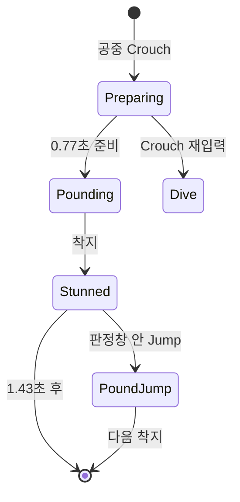

# 01. 마리오 이동과 액션

## 1. 책임과 구성

`AMarioCharacter`는 프로젝트의 가장 큰 단일 클래스다. 캐릭터 이동뿐 아니라 카메라, 캐피 생성, 캡처 전후 정리, HP, 피격, 사망 페이드, 체크포인트까지 담당한다.

주요 컴포넌트는 다음과 같다.

| 컴포넌트 | 역할 |
|---|---|
| Capsule / SkeletalMesh | 캐릭터 이동 충돌과 시각 표현 |
| `USpringArmComponent` | 1,500 UU 거리의 3인칭 카메라 암 |
| `UCameraComponent` | 실제 ViewTarget으로 사용하는 카메라 |
| `UCaptureComponent` | 캡처 상태와 Pawn 교체 조정 |
| `WallDetector` | 벽 후보 Overlap 감지 |
| `LedgeDetector` | 난간 후보 감지. 현재 로그 외 실제 동작 미구현 |

## 2. 입력 액션

실제 키 매핑은 `/Game/Input/IMC_Player`에 있고 C++은 다음 액션을 바인딩한다.

| InputAction | 처리 함수 | 기능 |
|---|---|---|
| `IA_Move` | `Move` | 카메라 Yaw 기준 평면 이동 |
| `IA_Look` | `Look` | 목표 ControlRotation 갱신 |
| `IA_Jump` | `OnJumpPressed` | 일반/연속/파운드 반동/벽차기/웅크리기 점프 |
| `IA_Crouch` | `OnCrouchPressed/Released` | 웅크리기, 공중 파운드, 파운드 중 다이브 |
| `IA_Run` | `OnRunPressed/Released` | 달리기 또는 웅크린 상태의 구르기 |
| `IA_ThrowCap` | `ThrowCap/OnThrowCapReleased` | 모자 생성과 호버 종료 요청 |

`BeginPlay`에서 Enhanced Input LocalPlayerSubsystem에 `IMC_Player`를 추가한다. Look 입력은 즉시 회전시키지 않고 `TargetControlRotation`을 누적한 뒤 Tick에서 `RInterpTo`로 보간한다.

## 3. 상태 표현

`FMarioState`는 다음 열거형 상태를 가진 일반 C++ 구조체다.

| 축 | 값 |
|---|---|
| 공중 액션 | None, LongJump, Backflip, PoundJump, Dive |
| 지상 액션 | None, Roll |
| 그라운드 파운드 | None, Preparing, Pounding, Stunned |
| 부가 플래그 | 달리기, 웅크리기, 파운드 점프 창, 공중 1회 사용 |

별도로 클래스에는 `bIsRolling`, `bIsDiving`, `bIsGroundPounding`, `bIsLongJumping`, `WallActionState` 등 실제 제어용 상태가 다수 존재한다. 현재 `FMarioState::CanMove()`는 그라운드 파운드의 Preparing/Pounding/Stunned만 차단하며, 나머지 액션 제한은 각 입력 함수가 개별 플래그를 검사한다.

즉 전체가 하나의 단일 FSM은 아니다. 여러 개의 작은 상태기와 플래그가 우선순위 규칙으로 결합된 구조다.

## 4. 기본 이동과 속도

| 항목 | 기본값 |
|---|---:|
| 걷기 | 200 UU/s |
| 달리기 | 690 UU/s |
| 회전 속도 | 720 deg/s |
| AirControl | 0.8 |
| GravityScale | 2.0 |
| 카메라 암 | 1,500 UU |

이동 방향은 ControlRotation의 Yaw만 사용해 Forward/Right 벡터를 만들고 `AddMovementInput`으로 적용한다. 캐릭터는 기본적으로 `bOrientRotationToMovement`가 켜져 이동 방향을 바라본다.

속도는 `ApplyMoveSpeed()`에서 걷기/달리기/웅크리기 상태를 반영하고, 구르기나 내리막 부스트가 실행 중이면 해당 시스템이 `MaxWalkSpeed`를 다시 덮어쓴다.

## 5. 3단 점프

착지 시각과 다음 점프 입력 간격이 `JumpChainTime = 0.25초` 이내이면 단계를 올린다.

| 단계 | JumpZVelocity |
|---:|---:|
| 1 | 850 |
| 2 | 890 |
| 3 | 1,230 |

연계 시간이 지나면 1단으로 초기화한다. 멀리뛰기와 백플립은 별도 기술이므로 점프 단계와 최근 착지 시간을 리셋한다. 공중에서 일반 Jump 입력은 무시하지만 벽 슬라이드 중이면 벽차기가 우선한다.

## 6. 웅크리기 파생 점프

지상에서 Crouch를 누르면 시작 순간의 평면 속도를 저장한다. 웅크린 상태에서 Jump를 누를 때 저장 속도와 현재 속도 중 큰 값을 사용한다.

```text
웅크리기 + Jump
  ├─ 속도 >= LongJump_MinSpeed2D → 멀리뛰기
  └─ 속도 <  LongJump_MinSpeed2D → 백플립
```

| 기술 | 발사 벡터 |
|---|---|
| 멀리뛰기 | 전방 950 + 상방 800 |
| 백플립 | 후방 200 + 상방 1,200 |

두 기술은 웅크리기를 해제하고 `LaunchCharacter`를 사용한다. 멀리뛰기는 공중 그라운드 파운드 진입을 막는다.

## 7. 구르기

구르기는 지상에서 웅크린 채 Run 입력을 눌렀을 때 시작한다. 상태는 `Start → Loop → End`로 나뉜다.

| 항목 | 값/동작 |
|---|---|
| 최대 이동 속도 | 900 UU/s |
| GroundFriction | 0.25 |
| 종료 속도 기준 | 160 UU/s |
| 조향 | 현재 입력 방향으로 보간 |
| 역입력 | 내적이 임계 이하이면 End 진입 |
| 공중 이탈 | 즉시 Abort |

Start 구간에는 짧은 강제 추진 시간이 있어 입력이 없어도 전진한다. Loop에서는 입력이 있을 때만 계속 추진한다. End에서는 추진을 멈추고 마찰/감속을 복원한 뒤 일반 이동으로 돌아간다.

구르기 시작/중단 함수가 CharacterMovement의 마찰, 제동, 속도 제한을 바꾸므로 피격·캡처·착지 이상 상황에서 `AbortRoll()`이 원복을 책임진다.

## 8. 그라운드 파운드와 반동 점프

공중에서 Crouch 입력 시 다음 순서로 실행한다.



- Preparing: 속도를 0으로 만들고 GravityScale을 0으로 설정
- Pounding: GravityScale을 복구하고 하방 속도 1,000으로 낙하
- 착지: 약 1.43초의 경직 및 반동 점프 입력 창 시작
- 반동 점프: 상방 속도 1,200으로 발사
- 파운드 준비/낙하 중 Crouch 재입력: 현재 방향 기반 다이브로 전환

파운드는 한 번의 공중 체류에서 1회만 사용할 수 있도록 `bGroundPoundUsed`가 막는다. 착지, 피격, 캡처 시작/종료에서 관련 타이머와 플래그를 정리한다.

착지 충격파와 일부 공중제비 애니메이션은 TODO로 남아 있다.

## 9. 다이브

다이브는 그라운드 파운드 준비/낙하 중 Crouch를 다시 눌러 시작한다.

| 항목 | 값 |
|---|---:|
| 전방 속도 | 1,100 |
| 상방 속도 | 450 |
| 다이브 중 AirControl | 0 |
| 다이브 중 MaxAcceleration | 0 |

파운드 시작 시 저장한 바라보는 방향을 우선 사용한다. 이동 입력과 공중 조향을 완전히 막고 캐릭터 회전을 발사 방향으로 고정한다. 착지 또는 피격 시 `EndDive()`가 AirControl, 가속도, 낙하 제동과 회전 정책을 기본값으로 되돌린다.

## 10. 벽 슬라이드와 벽차기

벽 액션 상태는 `None → SlideStart → SlideLoop → WallKick`이다.

### 진입 조건

- 낙하 중이어야 함
- 일반 점프 1~3단, 백플립, 파운드 점프 계열만 허용
- 멀리뛰기, 다이브, 구르기, 그라운드 파운드 중에는 금지
- WallDetector Overlap만 믿지 않고 여러 방향 Sphere Sweep으로 벽 법선을 재확인
- 벽 법선의 Z가 충분히 작아 수직 벽에 가까워야 함
- 캐릭터가 벽을 향하는 정도가 내적 약 0.75 이상이어야 함

### 물리

- SlideStart 약 0.83초 뒤 SlideLoop 전환
- 상승 중에는 기본 중력을 유지
- 하강 구간에는 GravityScale을 0으로 두고 Z 속도를 약 -220으로 고정
- 벽 법선 방향 속도를 제거해 벽 안으로 파고드는 것을 방지
- 이동 입력은 슬라이드 동안 차단

### 벽차기

- 벽 반대 방향 500 + 상방 920으로 Launch
- 약 0.12초 입력 잠금
- 같은 벽에 즉시 재진입하는 떨림을 막기 위해 overlap grace, 재진입 지연, 같은 벽 판정 창을 둠

Overlap과 Sweep을 함께 쓰는 이유는 빠른 이동, 충돌 프로필 차이, 컴포넌트 경계에서 발생하는 이벤트 누락을 보완하기 위해서다.

## 11. 내리막 달리기 부스트

달리면서 경사면을 실제 내리막 방향으로 이동할 때 속도를 점진적으로 추가한다.

| 항목 | 값 |
|---|---:|
| 최소 경사각 | 12도 |
| 최소 속도 | 250 UU/s |
| 추가 최대 속도 | 400 UU/s |
| 상승 보간 속도 | 1.5 |
| 감쇠 속도 | 1.0 |
| 유지 시간 | 2.35초 |
| 내리막 방향 내적 임계 | 0.55 |

바닥 법선에 중력 방향을 투영해 내리막 벡터를 구하고, 실제 속도 방향과 내적한다. 조건을 벗어나도 Hold 시간이 남아 있으면 바로 끊지 않고 부드럽게 감쇠한다. 다이브, 파운드, 구르기, 웅크리기, 공중 상태에서는 비활성화한다.

## 12. HP, 피격, 사망, 체크포인트

- 기본 최대 HP: 3
- HP 변화는 `UMarioGameInstance::SetHP`로 동기화되어 HUD로 전달
- 몬스터 접촉은 CapturableInterface 또는 `Monster`/`Capturable` 태그로 판정
- 반복 Hit를 막기 위한 접촉 피해 쿨다운 존재
- 피격 시 구르기·다이브·파운드 등을 중단하고 입력 잠금/HitStun 적용
- HP가 0이면 사망 몽타주 → 검은 화면 페이드 → 체크포인트 텔레포트 → HP 완전 회복 → 페이드 아웃
- 월드 아래로 추락해도 같은 사망 시퀀스를 사용
- 체크포인트가 없을 때는 BeginPlay에서 잡은 기본 Transform이 사용됨

캡처 중에는 숨겨진 마리오가 직접 피해를 받지 않도록 `TakeDamage`가 0을 반환한다. 캡처 해제 후에는 1초의 무적 시간을 둔다. 캡처 Pawn 피해가 마리오 HP로 실제 전달되는지는 별도 캡처 경로 문제이며 02번과 10번 문서에서 다룬다.

## 13. 미완성 또는 확장 지점

- LedgeDetector는 Overlap 로그만 있고 매달리기/이동/올라가기 로직이 연결되지 않았다.
- `ELedgeActionState` 열거형은 존재하지만 실제 상태 전이가 없다.
- 그라운드 파운드 착지 애니메이션/충격파 TODO가 남아 있다.
- 액션 상태가 `FMarioState`와 개별 bool에 분산돼 있어 새 기술 추가 시 모든 종료 경로를 함께 수정해야 한다.
