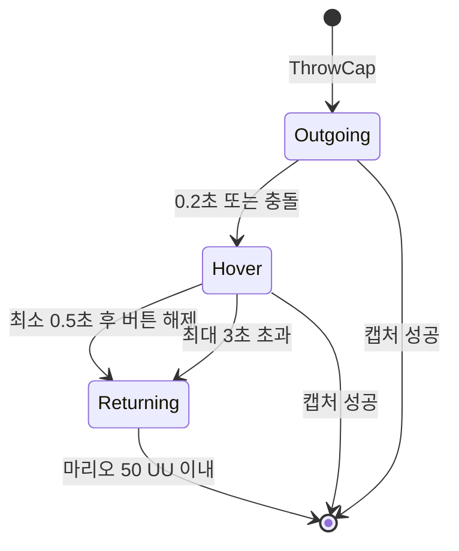
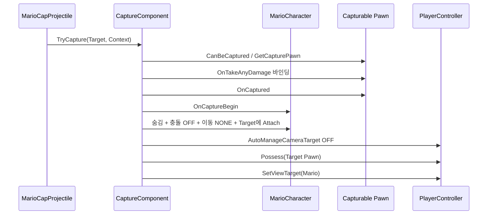

# 02. 캐피 투척과 캡처

## 1. 시스템 목적

캡처 시스템은 “모자를 던져 대상에 명중 → 대상 Pawn을 직접 조작 → 수동 또는 강제 해제 → 마리오로 복귀”를 구현한다. 핵심 클래스는 다음 셋이다.

| 클래스 | 책임 |
|---|---|
| `AMarioCapProjectile` | 모자의 왕복 비행, 충돌, 캡처 시도 |
| `UCaptureComponent` | 캡처 상태, Possess/ViewTarget 전환, 해제 위치 |
| `ICapturableInterface` | 대상별 캡처 가능 조건과 진입/해제 콜백 |

## 2. 캡처 계약

`ICapturableInterface`는 캡처 가능한 액터가 제공해야 할 계약이다.

| 함수 | 의미 |
|---|---|
| `CanBeCaptured(Context)` | 현재 상태에서 캡처 가능한가 |
| `GetCapturePawn()` | 실제로 Possess할 Pawn 반환 |
| `OnCaptured(Capturer, Context)` | AI 정지, 상태/속도 변경 등 진입 처리 |
| `OnReleased(Context)` | AI 복귀, 속도/충돌 복구 |
| `OnCapturedPawnDamaged(...)` | 캡처 중 피격 리액션 |

`FCaptureContext`에는 원본 모자, PlayerController, 충돌 위치가 들어간다. 해제 컨텍스트는 Manual, GameOver, InvalidPawn의 이유를 전달한다.

## 3. 캐피 비행 상태기

`AMarioCapProjectile`의 단계는 `Outgoing → Hover → Returning`이다.

| 항목 | 값 |
|---|---:|
| 전진 단계 | 0.2초 |
| 최소 호버 | 0.5초 |
| 최대 호버 | 3.0초 |
| 귀환 속도 | 2,600 UU/s |
| 회수 거리 | 50 UU |

버튼을 일찍 놓아도 최소 호버 시간이 끝날 때까지 대기한다. 최대 호버 시간이 지나면 홀드 여부와 관계없이 귀환한다.

귀환은 ProjectileMovement의 단순 Homing이 아니라 Tick에서 `SafeMoveUpdatedComponent`로 직접 이동한다. 시작 지점이 벽과 겹쳤다면 외부로 밀어내고, 이동이 막히면 벽 평면 슬라이드와 접선 방향 보정을 시도한다. 이는 캐피가 얇은 벽이나 모서리에 영구 정지하는 문제를 줄이기 위한 로직이다.

## 4. 충돌과 캡처 판정

모자는 Hit와 Overlap 양쪽에서 같은 캡처 시도를 수행한다. `Cap_Flight`가 Monster 채널을 Overlap하도록 설정돼 있지만 블루프린트별 충돌 응답 차이에도 견디기 위한 중복 안전장치다.

판정 순서는 다음과 같다.

1. 충돌 Actor 자체가 `ICapturableInterface` 구현인지 확인
2. 아니면 충돌 Component의 Owner를 다시 확인
3. 보조 호환으로 `Capturable` 또는 `Monster` ActorTag 확인
4. `UCaptureComponent::TryCapture` 호출
5. 캡처에 실패하면 대상에 1 피해 적용

마리오는 동시에 하나의 `ActiveCap`만 유지한다. 모자가 파괴되면 OnDestroyed 델리게이트로 참조를 비워 다음 투척을 허용한다.

## 5. 캡처 진입 순서

`UCaptureComponent::TryCapture`의 실제 순서는 중요하다.

핵심은 조작 대상과 카메라 대상이 다르다는 점이다.

- PlayerController의 Pawn: 캡처된 몬스터
- PlayerController의 ViewTarget: 숨겨진 마리오
- 마리오: 몬스터에 Attach되어 함께 이동
- 카메라: 마리오의 SpringArm/Camera를 계속 사용

이 구조 덕분에 몬스터마다 카메라 컴포넌트를 만들지 않아도 기존 마리오 카메라 감각을 유지할 수 있다.

## 6. 캡처 중 카메라

CaptureComponent는 Tick마다 ViewTarget이 마리오인지 확인해 다시 지정한다. 동시에 `AMarioCharacter::UpdateCaptureCamera`를 호출해 다음을 수행한다.

- 캡처 Pawn의 Look 입력은 `ForwardLookInputToMario`로 전달
- 마리오가 가진 목표 ControlRotation을 계속 보간
- 컨트롤러가 캡처 Pawn을 Possess해도 카메라 회전은 마리오 기준으로 유지

`ABgmManager`도 PlayerPawn이 아니라 ViewTarget 위치를 Listener로 사용한다. 따라서 캡처 중에도 마리오가 붙어 있는 몬스터 위치를 기준으로 BGM 존이 동작한다.

## 7. 캡처 해제 순서

1. 캡처 Pawn의 데미지 델리게이트 해제
2. 마리오 출구 후보 계산
3. 몬스터에서 Detach, 숨김/충돌 복구
4. PlayerController가 마리오를 다시 Possess
5. AutoManageActiveCameraTarget 복구
6. ViewTarget을 마리오로 복구
7. 마리오 `OnCaptureEnd` 호출
8. 대상이 AI Pawn이면 기본 컨트롤러 재스폰
9. 대상 `OnReleased` 호출
10. 마리오에게 해제 후 약 1초 무적 적용

### 출구 위치 계산

기본 후보는 캡처 Pawn의 정면 + 위쪽이다. 마리오 캡슐 크기로 Overlap 검사를 해 비어 있으면 사용한다. 막혔다면 NavigationSystem의 `ProjectPointToNavigation`으로 안전한 위치를 찾고, 최후에는 원점보다 200 UU 위를 사용한다.

이 계산은 벽 내부, 낮은 천장, 스택 내부에서 캡처를 풀었을 때 마리오가 끼는 문제를 완화한다.

## 8. 몬스터 공통 진입/해제

`AMonsterCharacterBase`는 인터페이스의 공통 구현을 제공한다.

- 진입: `bIsCaptured = true`, AI 중지, 캡처한 마리오 캐시, 캡처 이동 속도 적용
- 입력: Move/Look/Run/Jump/Crouch 바인딩
- Look: 숨겨진 마리오 카메라로 전달
- Crouch: 기본적으로 수동 캡처 해제
- 해제: 기본 걷기/달리기 속도 복구, 파생 콜백 실행

각 몬스터는 `OnCapturedExtra`, `OnReleasedExtra`와 입력 함수를 오버라이드해 능력을 추가한다.

## 9. 확인된 피해 전달 불일치

코드 주석은 “맞는 것은 몬스터, HP는 마리오”라고 설명한다. 그러나 `UCaptureComponent::HandleCapturedPawnAnyDamage`의 실제 구현은 다음 동작만 한다.

1. 현재 캡처 Pawn이 맞았는지 검사
2. 대상의 `OnCapturedPawnDamaged` 호출
3. 종료

`OriginalMario->TakeDamage` 또는 `ApplyDamage(OriginalMario, ...)` 호출은 없다. 몬스터 공통/굼바 구현도 입력 스턴과 넉백만 처리한다. 또한 마리오의 `TakeDamage`는 캡처 중 직접 호출되면 0을 반환한다.

따라서 현재 C++ 경로만 보면 캡처 중 Pawn 피격은 리액션은 발생하지만 마리오 HP가 줄지 않는다. 이것은 의도와 구현이 다른 고우선순위 검증 항목이다.

## 10. 확장 시 체크리스트

새 캡처 대상을 추가할 때 다음을 모두 정해야 한다.

- 어떤 상태에서 `CanBeCaptured`가 true인가
- `GetCapturePawn`이 자기 자신인지 별도 Pawn인지
- 캡처 중 이동 모드와 속도
- Move/Run/Jump/Crouch의 의미
- Look 입력을 마리오 카메라로 전달하는지
- AI와 타이머를 어떻게 정지/복원하는지
- 해제 시 스폰해야 할 AIController가 있는지
- 캡처 중 피격이 HP, 강제 해제, 스턴 중 무엇을 유발하는지
- 사망이나 Pawn 파괴 시 `InvalidPawn` 해제가 안전하게 실행되는지
