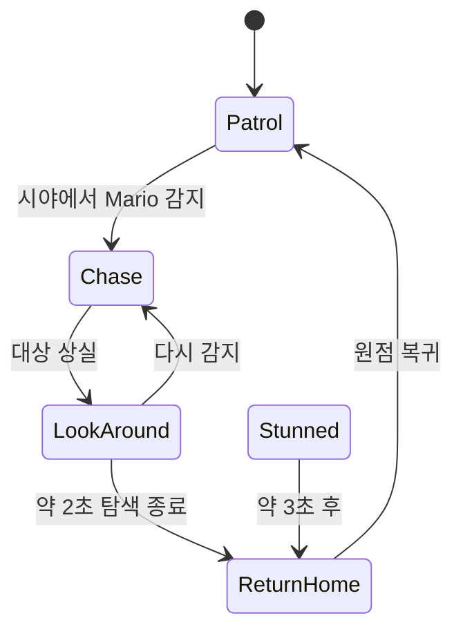

# 03. 몬스터 공통과 파생 캐릭터

## 1. 계층 구조

```text
ACharacter
└─ AMonsterCharacterBase + ICapturableInterface
   ├─ AGoombaCharacter
   ├─ ABulletBillCharacter
   ├─ AVolteDaCharacter
   └─ AAttrenashinFist
```

보스 주먹도 일반 몬스터 베이스를 상속한다. 따라서 같은 캐피/캡처 파이프라인으로 보스 공략용 Pawn을 조작할 수 있다.

## 2. MonsterCharacterBase

### 공통 컴포넌트와 충돌

- Character Capsule: `Monster_Capsule`
- Mesh: `Monster_Mesh`
- 접촉 감지 Sphere: `Monster_ContactSphere`
- `Capturable`, `Monster` 태그를 보조 판정에 사용할 수 있음

마리오 캡슐과 몬스터 캡슐은 Block이므로 기본 접촉 피해는 마리오의 Capsule Hit에서 처리한다. MonsterBase의 ContactSphere 피해는 기본적으로 꺼져 있어 중복 데미지를 막는다. 필요한 파생 클래스만 `bContactDamageAffectsMario`를 켤 수 있다.

### 공통 캡처 입력

| 입력 | 기본 동작 |
|---|---|
| Move | 카메라 Yaw 기준 `AddMovementInput` |
| Look | 마리오 카메라로 전달 |
| Run | 캡처 걷기/달리기 속도 전환 |
| Jump | Character Jump |
| Crouch | 수동 캡처 해제 |

캡처 중 피격 시 공통 구현은 잠시 입력을 잠그고 피해 발생 위치 반대 방향으로 넉백한다. HP 차감은 실제 구현돼 있지 않으며 02번 문서의 불일치 항목을 참고한다.

## 3. Goomba AI

굼바는 간단한 자율 상태기를 사용한다.



주요 값과 규칙:

- 감지 거리 약 500 UU
- 거리와 전방 Cone Dot을 함께 사용
- Patrol은 NavigationSystem에서 홈 주변 약 600 UU 랜덤 지점을 선택
- 대상 상실 후 약 2초 LookAround
- 홈에서 너무 멀리 떨어지거나 장시간 이탈하면 ReturnHome
- 캡처 해제 후 약 3초 Stunned를 거쳐 복귀

굼바의 핵심 복잡도는 AI보다 스택에 있으며 04번 문서에서 별도로 다룬다.

## 4. Bullet Bill

킬러는 지상 Character 이동 대신 전방 비행과 Sweep 충돌을 직접 처리한다.

| 상태 | 동작 |
|---|---|
| 비캡처 | 마리오를 향해 Yaw를 보간하며 전진 |
| 캡처 | A/D 계열 Move X로 Yaw 조향, 지속 전진 |
| 충돌 | 대상에 피해 후 캡처 해제/폭발 |
| 수명 종료 | 약 12초 후 파괴 |

주요 기본값:

- 비캡처 속도 약 1,600 UU/s
- 캡처 속도 약 1,700 UU/s
- 스폰 직후 충돌 유예 0.15초
- 발사기는 기본 8초 간격으로 생성

충돌 시 비캡처 상태면 마리오에게 1 피해, 캡처 상태면 충돌한 몬스터에게 1 피해를 적용한다. 이후 캡처 중이었다면 마리오를 해제하고 자신은 폭발한다. 벽이나 액터에 부딪히는 것이 이동 수단의 종료 조건이므로 플랫폼 횡단용 일회성 능력에 가깝다.

`ABulletBillLauncher`는 Arrow 방향, 전방/상방 오프셋으로 킬러를 생성하며 발사기 자체와의 충돌을 Ignore한다.

## 5. VolteDa

VolteDa는 선글라스 착용 여부로 탐색 능력과 이동 속도가 바뀌는 캡처 대상이다.

### 캡처 중

| 상태 | 속도 | 숨은 오브젝트 |
|---|---:|---|
| 선글라스 ON | 약 230 | `MoeEyeHidden` 태그 Actor 표시 |
| 선글라스 OFF / Run 유지 | 약 520 | 다시 숨김 |

캡처 진입 시 선글라스를 켜고 숨은 액터를 표시한다. Run 입력을 누르면 빠르게 이동하는 대신 선글라스를 벗고 감지 능력을 잃는다. 해제하면 월드 액터 표시 상태를 원복한다.

표시 갱신은 매 Tick 호출될 수 있지만 내부에서 현재 표시 상태를 캐시해 실제 `SetActorHiddenInGame` 호출을 줄인다.

### 비캡처 AI

- 마리오가 약 1,400 UU 안에 있는지 검사
- 마리오/카메라가 자신을 바라보는 정도를 Dot 약 0.45로 검사
- 관찰되면 반대 방향으로 도망
- 시야를 벗어나도 약 0.6초간 도망 상태 유지

이는 “바라보면 반응하는 NPC”와 “느려지는 대신 비밀을 보는 캡처 능력”을 한 캐릭터에 결합한 설계다.

## 6. 몬스터별 비교

| 타입 | 비캡처 행동 | 캡처 능력 | 종료/제약 |
|---|---|---|---|
| Goomba | 순찰·추격·복귀 | 걷기/달리기/점프, 스택 | 수동 해제, 피격 스턴 |
| Bullet Bill | Yaw 추적 비행 | 고속 비행과 조향 | 충돌/수명으로 폭발 |
| VolteDa | 바라보면 도망 | 숨은 액터 탐지 | 빠른 이동 시 탐지 해제 |
| AttrenashinFist | 보스 패턴 FSM | 평면 조향/대시, 머리 공격 | 얼음 기절 때만 캡처 가능 |

## 7. 확장성과 결합도

좋은 점은 공통 캡처 수명주기와 입력을 베이스에 모은 것이다. 반면 다음 요소는 파생 클래스마다 주의해야 한다.

- CharacterMovement를 쓰는 타입과 직접 Sweep 이동하는 타입의 차이
- AIController 정지/재생성 시 기존 AI 상태 보존 여부
- 캡처 중 카메라 Look 전달 누락
- 파괴형 Pawn에서 ReleaseCapture와 Destroy 호출 순서
- 태그 기반 월드 액터 검색 비용과 레벨 스트리밍 시 신규 액터 반영
