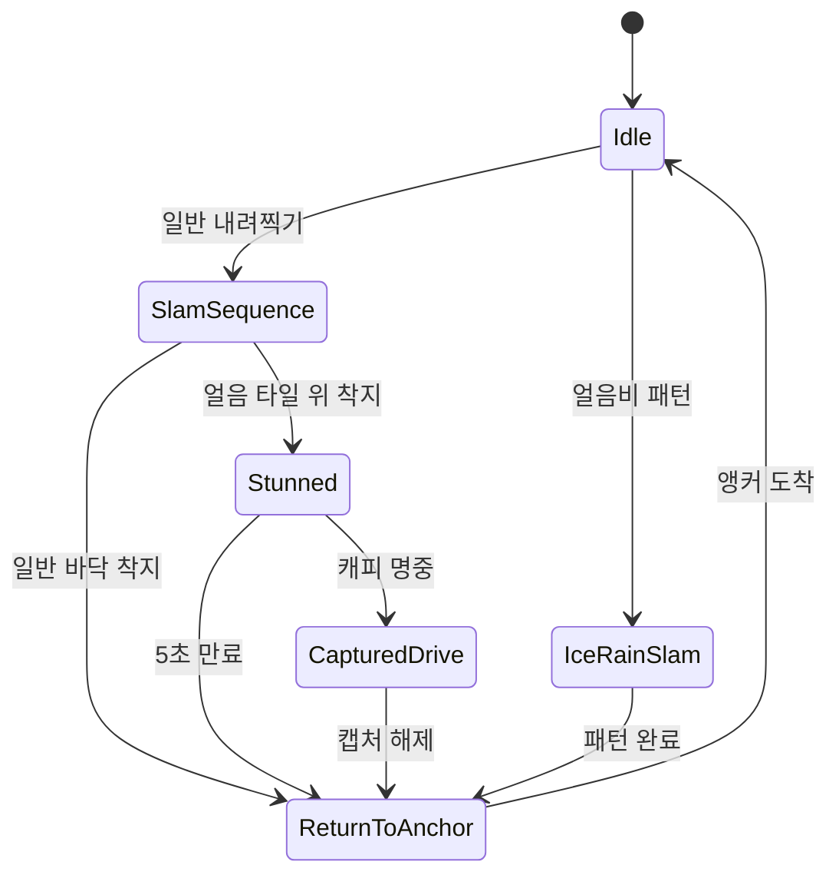
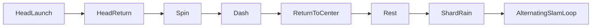

# 05. Attrenashin 보스 전투

## 1. 전투 핵심

Attrenashin 전투는 체력을 직접 깎는 방식이 아니다. 보스 머리 타격 횟수를 진행도로 사용하며 기본 클리어 조건은 3회다.

```text
주먹 내려찍기 유도
  → 기존 얼음 타일 위에 주먹이 착지
  → 주먹 5초 기절
  → 캐피로 주먹 캡처
  → 주먹을 조종해 보스 머리 충돌
  → 캡처 강제 해제 + 다음 페이즈
```

보스 본체 `AAttrenashinBoss`는 머리·양손의 전체 패턴을 조정하고, 실제 손은 캡처 가능한 `AAttrenashinFist` Pawn 두 개로 스폰된다.

## 2. 클래스 구성

| 클래스 | 책임 |
|---|---|
| `AAttrenashinBoss` | 페이즈 흐름, 머리 판정, 양손 명령, 얼음 소환, 캡처 카운터 |
| `AAttrenashinFist` | 손 단위 공격 FSM, 기절, 캡처 조작, 앵커 복귀 |
| `AIceShardActor` | 낙하 얼음 또는 캡처 카운터 투사체 |
| `AIceTileActor` | 주먹을 기절시키는 지면 표식/기믹 |
| `UAttrenashinBossAnimInstance` | 보스 페이즈 값을 Anim BP에 노출 |
| `UAttrenashinFistAnimInstance` | 손 상태와 Slam 하위 상태를 Anim BP에 노출 |

보스에는 Left/Right Fist Anchor가 있고 BeginPlay에서 `FistClass` 두 개를 생성해 각 앵커와 Side를 주입한다.

## 3. 주먹 FSM

`EFistState`는 다음 여섯 상태를 갖는다.



캡처 가능 조건은 오직 `State == Stunned`다. 따라서 캐피를 바로 맞히는 것으로는 공략할 수 없다.

## 4. 일반 내려찍기 시퀀스

`SlamSequence` 안에는 별도 하위 상태 `EAttrenashinSlamSeq`가 있다.

| 순서 | 상태 | 기본 시간 | 동작 |
|---:|---|---:|---|
| 1 | MoveAbove | 2.5초 | 플레이어 위쪽으로 이동 |
| 2 | FollowAbove | 1.0초 | 플레이어 XY 추적 |
| 3 | PreSlamPause | 최소 0.9초 | 위치를 고정해 공격 예고 |
| 4 | SlamDown | 0.12초 | 지면까지 급강하 |
| 5 | PostImpactWait | 1.0초 | 충돌 판정 유지, 결과 대기 |

지면 목표는 현재 XY에서 위/아래 8,000 UU Visibility LineTrace로 구한다. 캡슐 반높이를 더해 손의 중심 위치를 결정한다.

공격 피해 Overlap은 SlamDown과 PostImpactWait에서만 켜진다. 접근/추적 중에는 꺼져 있어 시각적 준비 동작이 피해를 주지 않는다.

### 얼음 기절 판정

급강하 목표를 계산할 때 착지점 반경 120 UU를 WorldStatic/WorldDynamic으로 Overlap한다. 다음 중 하나면 착지 후 Stunned로 전환한다.

- Actor가 `AIceTileActor`
- ActorTag가 `IceTile`

즉 주먹이 얼음 타일을 “생성하는 순간”이 아니라, 이후 일반 내려찍기가 이미 생성된 얼음 타일 위에 떨어질 때 기절한다.

## 5. IceRainSlam과 얼음 타일 생성

양손 또는 한 손이 `IceRainSlam`에 들어가면 다음 동작을 한다.

1. 현재 위치에서 1.33초 동안 800 UU 상승
2. 0.17초 동안 원래 XY의 바닥으로 급강하
3. 착지 순간 보스의 `PerformGroundSlam_IceShardRain()` 1회 호출
4. 지정 반경 안 상공에 얼음 조각 12개 생성
5. 얼음 조각이 지면에 멈추면 `AIceTileActor` 생성
6. 손은 앵커로 복귀

IceRainSlam 동안 해당 손은 얼음 기절을 무시한다. 그렇지 않으면 얼음비를 만드는 공격 자체가 기존 타일에 의해 끊길 수 있기 때문이다.

일반 RainTile 모드 얼음 조각은 낙하 중 마리오에게 1 피해를 줄 수 있고, 바닥에 정지하면 타일을 만든다.

## 6. 캡처된 주먹 조작

기절한 손을 캡처하면 `CapturedDrive`가 된다.

- CharacterMovement를 Disable하고 Actor 위치를 직접 갱신
- 기본 평면 조향 속도 약 1,100 UU/s
- Yaw 회전 속도 약 220 deg/s
- Run 입력은 약 2배 대시 배율
- 입력이 없을 때도 Shift/Run이면 전진 가능하도록 옵션 제공
- 아레나 규칙상 기본 World Z 1,500에 고정
- 카운터 얼음 피격 넉백은 XY만 누적하고 최대 약 900으로 제한

캡처 주먹이 HeadHitSphere와 겹치면 머리 타격이 인정된다. 기본값 `bRequireCapturedFistForHeadHit = true`라서 비캡처 손이나 일반 투사체로는 카운트되지 않는다.

## 7. 캡처 카운터 Barrage

한 손이 캡처되면 보스는 공포 상태로 후퇴하고 다른 손을 발사 위치로 사용한다.

| 항목 | 기본값 |
|---|---:|
| 발사 간격 | 1.0초 |
| 얼음 조각 속도 | 2,600 UU/s |
| 강제 해제까지 피격 | 3회 |
| 평면 넉백 | 320 |

다른 손이 공격 중이면 약 0.15~0.20초 복귀 상태로 강제한 뒤 앵커에서 캡처 주먹을 향해 `CaptureBarrage` 모드 얼음 조각을 발사한다.

이 모드는 마리오 피해와 타일 생성을 끄고 캡처된 손만 목표로 한다. 명중할 때마다 손을 밀고 카운트를 올리며 3회면 `ForceReleaseCaptureByBoss()`를 호출한다. 플레이어는 제한 시간 대신 회피 가능한 투사체 압박 속에서 머리까지 이동해야 한다.

## 8. 머리 충돌 규칙

HeadHitSphere Overlap은 두 종류를 구분한다.

### 마리오 직접 접촉

- 마리오가 닿으면 1 피해
- 약 0.4초 접촉 쿨다운
- 머리 타격 카운트에는 포함되지 않음

### 캡처 주먹 접촉

- `HeadHitCount` 1 증가
- 1단계라면 Phase2 시작
- Phase2에서 다음 유효 타격이면 Phase3 시작
- 주먹 캡처를 강제 해제
- 마리오를 월드 원점 방향으로 XY 2,100 + Z 380만큼 Launch해 전장으로 복귀

아레나 컨트롤러는 매 Tick HeadHitCount를 읽고 기본 3 이상이면 승리 처리한다.

## 9. Phase 1

Phase1은 약 6초 간격으로 왼손/오른손을 번갈아 일반 SlamSequence에 넣는다. 우선 손이 사용할 수 없으면 반대 손을 선택한다.

캡처가 시작되면:

- 일반 Slam 생성 루프 정지
- 보스가 플레이어 반대 방향으로 후퇴
- 다른 손의 CaptureBarrage 시작
- 캡처가 실패/해제되면 약 3초 뒤 보스와 비캡처 손이 월드 중앙으로 복귀

첫 번째 머리 타격이 Phase2 전환 트리거다.

## 10. Phase 2

첫 머리 타격 뒤 `EPhase2FlowState`가 다음 순서로 진행한다.



### HeadLaunch / Return

머리 판정 Sphere를 후방 2,300 + 상방 1,850 속도로 날리고 중력 4,200을 적용한다. 최소 0.28초가 지나고 원래 위치보다 320 UU 이상 떨어지면 약 1.1초 동안 원위치로 보간한다.

### Spin / Dash

- 양손을 앵커로 모은 뒤 약 3초 회전 연출
- 양손을 보스의 월드 원점 반대편 위치까지 약 9,000 UU/s로 Dash
- 완료 후 보스와 손을 약 1초에 걸쳐 월드 중앙으로 복귀
- 약 2초 휴식

### ShardRain / AlternatingSlamLoop

- 양손이 Idle이면 동시에 IceRainSlam
- 두 손의 패턴과 복귀가 끝나면 약 3.2초 간격 일반 Slam 반복
- 이 반복 중 다시 손을 기절·캡처할 수 있음
- 두 번째 머리 타격이 Phase3 전환 트리거

## 11. Phase 3

Phase3는 Phase2의 HeadLaunch → HeadReturn → Spin → Dash → ReturnToCenter 흐름을 다시 사용하되, 휴식 후 양손 박수 패턴을 추가한다.

### 박수 하위 상태

```text
Tracking → Hold → Close → Open → 다음 Tracking
```

| 항목 | 기본값 |
|---|---:|
| 박수 횟수 | 3회 |
| 첫 추적 | 5.0초 |
| 이후 추적 | 1.0초 |
| 위치 고정 예고 | 0.8초 |
| 닫기 | 0.12초 |
| 열기 | 0.18초 |
| 마리오 양옆 거리 | 520 UU |
| 추적 이동 속도 | 2,600 UU/s |

양손 위치는 마리오 자신의 RightVector가 아니라 “보스 머리에서 마리오를 향한 방향”에 수직인 축으로 계산한다. 따라서 마리오 회전과 관계없이 화면/전투 방향 기준 양쪽을 안정적으로 잡는다.

Tracking 중에는 목표를 실시간 갱신하고, Hold 진입 시 현재 양옆 위치를 고정해 공격을 예고한다. Close에서 양손이 중앙 35 UU 지점까지 빠르게 접근하고 Open으로 돌아간다. 3회 완료 후 ShardRain → AlternatingSlamLoop로 이어진다.

세 번째 유효 머리 타격이 들어오면 아레나의 클리어 조건이 충족된다.

## 12. 애니메이션 연동

Boss AnimInstance는 Phase0~3 bool을 Anim Blueprint에 제공한다. Fist AnimInstance는 FistState, SlamSeq, SlamSeqTime과 상태별 bool을 제공한다.

Phase2 Spin과 Phase3 Clap은 별도 플래그를 주먹에 설정하지만 현재 C++ AnimInstance 헤더에는 이 값을 읽는 변수 노출이 보이지 않는다. Blueprint가 Fist 함수를 직접 호출할 수는 있으나, 실제 Anim BP 전이가 어떻게 연결됐는지 에디터 확인이 필요하다.

## 13. 주요 결합 지점

- 충돌 프로필: Boss Fist/Head/IceShard/IceTile 전용 프로필에 강하게 의존
- 월드 원점: 중앙 복귀, 반대편 Dash, 얼음비 중심 계산이 `(0,0)` 기준
- 고정 Z: 캡처 손 기본 높이 1,500
- 실제 승리 조건: Boss의 HeadHitCount와 ArenaController의 HeadHitsToClear가 별도 값
- BGM: BossArenaController가 함수를 제공하지만 C++ 전투 시작 경로에서는 자동 호출하지 않음

레벨의 보스 배치 좌표가 바뀌거나 여러 아레나를 재사용하려면 월드 원점 하드코딩을 ArenaCenter 컴포넌트 기준으로 바꾸는 것이 우선 과제다.
