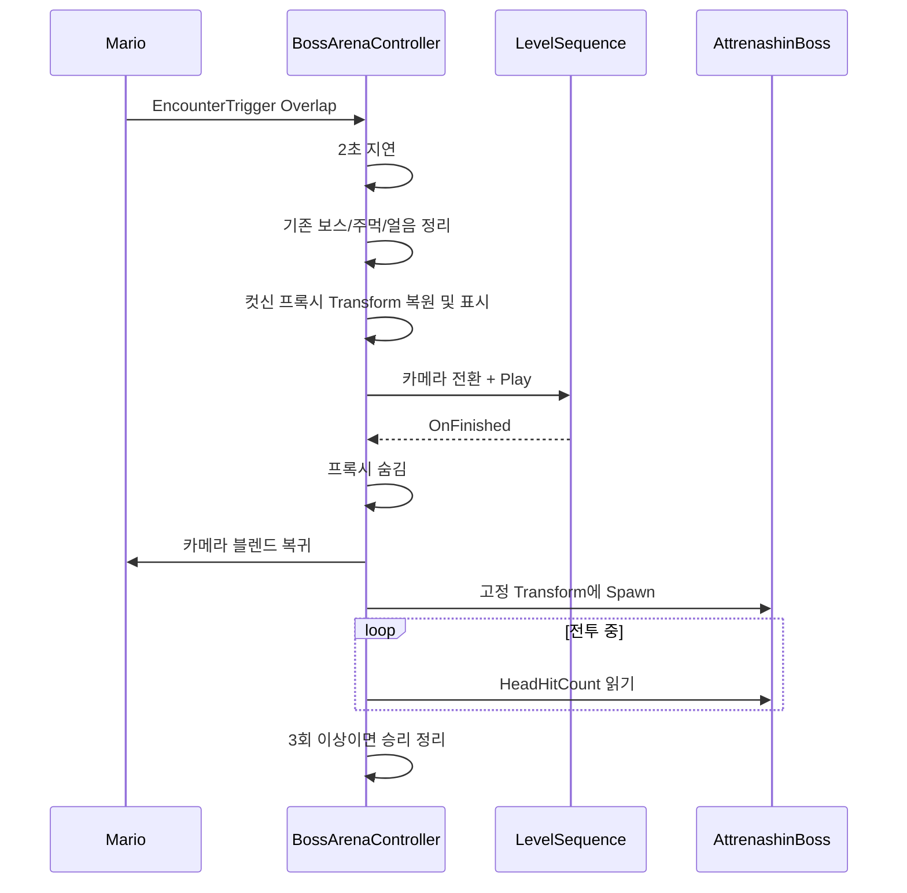

# 06. 보스 아레나와 컷신

## 1. 역할

`ABossArenaController`는 보스의 공격 패턴이 아니라 조우 전체 생명주기를 담당한다.

- 플레이어 진입 감지
- 조우 시작 지연
- Level Sequence 재생
- 컷신용 프록시 표시/숨김
- 실제 보스 스폰
- 머리 타격 진행 감시
- 승리/플레이어 사망 정리
- 재도전 가능 상태 복구
- 보스 BGM 시작/정지 API 제공

## 2. 아레나 상태

명시적인 enum은 없고 여러 bool로 상태를 표현한다.

| 플래그 | 의미 |
|---|---|
| `bHasEncounterStarted` | 트리거 진입 후 조우 수명주기 안에 있음 |
| `bWaitingForEncounterDelay` | 기본 2초 시작 지연 중 |
| `bIsCutscenePlaying` | 조우 Level Sequence 재생 중 |
| `bWaitingForBossSpawn` | 보스 생성 임계 구간 |
| `BossActor.IsValid()` | 실제 전투 진행 중 |
| `bBossDefeated` | 클리어 완료 |

`IsEncounterActive()`는 Boss 존재, 컷신, 스폰 대기, 지연 대기 중 하나면 true를 반환한다.

## 3. 정상 조우 흐름

트리거는 CachedMario와 정확히 같은 Actor만 받는다. 캡처 Pawn으로 트리거에 들어오는 경우에는 ViewTarget이 마리오여도 OtherActor가 몬스터이므로 조우가 시작되지 않는다.

## 4. 컷신 프록시

실제 보스 Pawn을 컷신에 직접 쓰지 않고 Head, RightHand, LeftHand 프록시 Actor를 사용할 수 있다.

### 캐시하는 값

- 초기 Transform
- Hidden 상태
- Collision 활성 상태
- Tick 활성 상태

### 조우 시작 전

- 기존 프록시를 저작 위치로 워프
- Head는 기본 `(0,0,9085)`와 지정 회전
- 양손은 기본 `(0,0,10000)`과 지정 회전
- 프록시 표시
- 기본 설정에서는 보이더라도 Collision은 끔

### 컷신 종료 후

- 저작 Transform을 다시 복원
- 프록시 숨김
- 실제 플레이어 카메라로 0.65초 블렌드
- 실제 BossClass 스폰

명시적 Head/Hand 참조 외에도 배열로 추가 프록시를 등록할 수 있다. 추가 프록시는 BeginPlay 초기 Transform으로 복원된다.

## 5. 보스 스폰

기본은 고정 월드 Transform을 사용한다.

| 항목 | 기본값 |
|---|---|
| 위치 | `(0, 0, 1035)` |
| 회전 | `(Pitch 0, Yaw 180, Roll 0)` |
| 충돌 처리 | AlwaysSpawn |
| Owner | BossArenaController |

`bUseFixedBossSpawnTransform`을 끄면 별도 `BossSpawnLocation/Rotation`을 사용한다. 스폰 성공 후 초기 HeadHitCount를 저장하고 Tick에서 변화를 감시한다.

## 6. 승리 처리

Boss의 `GetHeadHitCount()`가 `HeadHitsToClear` 기본 3 이상이면 다음 순서로 처리한다.

1. 중복 실행 방지용 `bBossDefeated` 설정
2. 조우/컷신/스폰 대기 플래그 정리
3. 시작 지연 Timer 취소
4. 보스 BGM FadeOut
5. Level Sequence Finished 델리게이트 제거
6. 보스, 모든 `AAttrenashinFist`, `AIceShardActor`, `AIceTileActor` Destroy
7. 프록시 숨김

현재 C++ 승리 처리에는 슈퍼문 보상, 다음 컷신, 문 개방 같은 후속 보상이 없다. 레벨 블루프린트나 다른 Actor가 별도로 처리하는지 에디터 확인이 필요하다.

## 7. 플레이어 사망과 재도전

ArenaController Tick은 CachedMario의 `IsGameOverPublic()`을 최우선으로 검사한다. 사망 상태면:

- 보스 BGM 중지
- 조우 시작 지연 취소
- 실행 중 Level Sequence 정지/델리게이트 제거
- 보스·양손·얼음 조각·얼음 타일 전체 제거
- 조우 플래그와 HeadHit 캐시 초기화
- 컷신 프록시 위치 복원 및 다시 표시
- 카메라를 즉시 마리오로 복귀

마리오의 사망 시퀀스는 체크포인트에서 부활한 뒤 `bGameOver`를 false로 되돌린다. ArenaController는 이후 트리거 재진입 또는 이미 시작된 상태에 따라 컷신을 다시 시작할 수 있다.

여기서 전역 `TActorIterator`로 모든 주먹/얼음 Actor를 제거한다. 현재 단일 보스 아레나에서는 실용적이지만 같은 월드에 독립적인 보스가 둘 이상 있으면 다른 전투의 Actor까지 제거할 수 있다.

## 8. BGM 연동

ArenaController는 `StartBossBGMNative()`와 `StopBossBGMNative()`를 BlueprintCallable로 노출한다.

- `SpawnSound2D`로 비공간 AudioComponent 생성
- FadeIn 기본 0.10초
- FadeOut 기본 0.25초
- 중복 시작 방지
- 레벨 전환 지속 옵션 사용

하지만 C++의 `BeginEncounterCutscene`, `OnEncounterCutsceneFinished`, `SpawnBossNow`에는 `StartBossBGMNative()` 호출이 없다. 정지 호출만 승리/사망 경로에 있다. 따라서 보스 BGM 시작은 `LS_BossEncounter`, `BP_ABossArenaController` 또는 다른 Blueprint 이벤트 연결에 의존하는 설계다. 해당 연결이 누락되면 BGM은 시작하지 않는다.

또한 일반 `ABgmManager`를 Suppress하는 코드가 ArenaController에 없다. 보스 BGM과 월드 BGM이 동시에 재생되는지는 블루프린트/레벨 설정 확인이 필요하다.

## 9. Arena 인트로와 보스 조우 컷신의 차이

`AArenaIntroCutsceneTrigger`는 Arena 입장 연출용이고 `ABossArenaController`의 컷신은 보스 조우 연출용이다.

| 항목 | ArenaIntroCutsceneTrigger | BossArenaController |
|---|---|---|
| 실행 조건 | 마리오 Trigger 진입 | 마리오 EncounterTrigger 진입 |
| 1회성 | GameInstance 세션당 1회 | 패배 시 재실행 가능 |
| 입력 잠금 | Move/Look Ignore | C++에는 별도 잠금 없음; 시퀀스 설정 의존 |
| 실제 Actor 스폰 | 없음 | 컷신 종료 후 Boss 스폰 |
| 프록시 관리 | 없음 | Head/Hands 프록시 관리 |

Arena 인트로는 재생 시작 시점에 GameInstance의 `bArenaIntroCutscenePlayed`를 즉시 true로 만든다. 도중 사망/중단돼도 같은 세션에서는 재생하지 않는 정책이다.

## 10. 개선 포인트

- bool 묶음을 `EEncounterState` enum으로 바꾸면 불가능한 조합을 줄일 수 있다.
- 전역 ActorIterator 정리는 Owner가 자기 자신인 Actor만 대상으로 좁히는 편이 안전하다.
- BGM 시작과 월드 BGM Suppress를 조우 상태 전이에 명시적으로 묶어야 연결 누락을 막을 수 있다.
- 보스 스폰/프록시 좌표를 월드 원점이 아닌 ArenaRoot SceneComponent 기준 Transform으로 바꾸면 재사용성이 높아진다.
- 컷신 중 입력 잠금, HUD 표시 정책을 ArenaController가 소유하면 Level Sequence 설정 의존도가 낮아진다.
