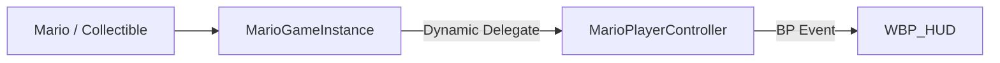
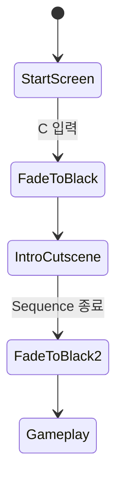

# 08. UI·시작 흐름·오디오

## 1. HUD 데이터 경로

HUD는 C++에서 구체 위젯을 직접 조작하지 않고 BlueprintImplementableEvent로 데이터를 전달한다.

`UMarioHUDWidget`가 제공하는 이벤트:

- `BP_OnHPChanged(CurrentHP, MaxHP)`
- `BP_OnCoinsChanged(Coins)`
- `BP_OnSuperMoonCountChanged(SuperMoons)`
- `BP_OnSuperMoonCollected(MoonId, TotalSuperMoons)`

실제 텍스트, 이미지, 애니메이션 갱신은 `/Game/_BP/UI/WBP_HUD`가 구현한다.

## 2. MarioPlayerController

GameMode는 기본 PlayerController로 `AMarioPlayerController`를 지정한다. Controller는 `/Game/_BP/UI/WBP_HUD` 클래스를 생성해 Viewport에 추가한다.

BeginPlay와 OnPossess에서 다음을 반복 보장한다.

1. HUD가 없으면 생성
2. GameInstance 델리게이트 바인딩
3. 현재 HP/코인/슈퍼문 값을 HUD로 즉시 Push

OnUnPossess에서는 바인딩을 해제하지 않는다. 캡처 때 Pawn이 바뀌어도 HUD를 계속 유지하기 위해서다. 실제 해제는 PlayerController EndPlay에서 한다.

## 3. 시작 화면 Widget

`UMarioStartScreenWidget`은 기본 시작 키로 C를 사용한다. `NativeOnKeyDown`에서 키가 일치하면:

- Blueprint `BP_OnStartPressed()` 호출
- `OnStartRequested` 델리게이트 Broadcast
- 입력을 Handled로 반환

UE 5.4에서는 Widget의 `bIsFocusable` 직접 설정이 deprecated이므로 `WBP_StartScreen`의 Is Focusable 옵션을 에디터에서 켜야 키 입력을 안정적으로 받는다.

## 4. MarioStartFlowActor

시작 흐름은 `AMarioStartFlowActor`가 오케스트레이션한다.

### 초기화

- 다음 Tick에 Start UI 생성
- HUD Widget들을 찾아 Hidden 처리
- Move/Look 입력 Ignore
- `FInputModeUIOnly`와 Widget Focus 설정
- BgmManager Suppress
- 시작 BGM과 Voice를 2D로 재생

### C 입력 후

- StartKey SFX 재생
- 시작 BGM/Voice FadeOut
- Start Widget 제거
- 화면을 검게 Fade
- 선택적 Delay 뒤 Level Sequence 실행

### 인트로 Sequence

우선 `IntroSequenceActor` 인스턴스 참조를 사용한다. 없으면 `MapIntro` 태그의 LevelSequenceActor를 찾고, 그래도 없으면 월드의 첫 LevelSequenceActor를 사용한다.

이 마지막 fallback은 편리하지만 레벨에 보스/블록 등 여러 Sequence가 있을 때 잘못된 컷신을 고를 수 있다. 명시 참조 또는 Tag 지정이 안전하다.

### 종료

- 화면을 다시 검게 Fade
- CinematicMode 해제
- ViewTarget을 현재 Pawn으로 강제 복귀
- `FInputModeGameOnly`
- Move/Look Ignore 해제
- HUD 표시
- BgmManager Suppress 해제
- 화면 FadeOut

Actor의 `bStarted/bCompleted`는 현재 레벨 Actor 인스턴스 생명 동안만 유지된다. 사망이 레벨 리로드가 아니라 텔레포트 방식이므로 사망 때 시작 화면이 재실행되지는 않는다.

## 5. Arena 인트로

`AArenaIntroCutsceneTrigger`는 포탈 이동 후 Arena 바닥에서 별도 Level Sequence를 한 번 재생한다.

- `AMarioCharacter` Overlap만 허용
- GameInstance의 `bArenaIntroCutscenePlayed`로 세션 1회 제한
- 재생 시작 시 즉시 Played 표시
- 옵션에 따라 Move/Look 입력 잠금
- Sequence 종료 시 입력 복구

이 Actor는 카메라 Fade, HUD, BGM을 직접 조정하지 않는다. 관련 연출은 Level Sequence 자체에 의존한다.

## 6. BgmManager

`ABgmManager`는 두 AudioComponent A/B를 번갈아 사용해 크로스페이드한다.

### 기본 흐름

- BeginPlay에서 DefaultTrack 자동 재생 가능
- 모든 `ABgmZoneTrigger`를 한 번 캐시
- 기본 0.1초 주기로 Listener 위치 폴링
- 현재 포함된 Zone 중 최고 Priority 선택
- Priority가 같으면 가장 최근 진입한 Zone 선택
- Zone이 없으면 DefaultTrack으로 복귀

`CurrentTrack == NewTrack`이면 처음부터 다시 재생하지 않는다. 다만 같은 Track인데 활성 AudioComponent가 멈췄다면 Play를 복구한다.

### 왜 위치 폴링인가

캡처 중 PlayerPawn은 몬스터로 바뀌고 마리오 Capsule 충돌은 꺼진다. Zone Overlap 이벤트에 의존하면 경계 이벤트를 놓칠 수 있다. 그래서 `PlayerController->GetViewTarget()` 위치를 0.1초마다 각 Box의 Local Space로 변환해 내부 여부를 계산한다.

### Suppress

시작 화면이나 컷신에서 `SetSuppressed(true)`를 호출하면 양쪽 AudioComponent를 FadeOut하고 트랙 전환을 중지한다. 해제할 때 현재 위치를 다시 평가해 적절한 Zone/Default BGM을 재생한다.

## 7. BgmZoneTrigger

Zone Actor의 BoxComponent는 기본적으로 Collision과 Overlap을 쓰지 않는다. 순수한 공간 데이터다.

| 설정 | 의미 |
|---|---|
| ZoneTrack | 해당 구역 BGM |
| Priority | 겹친 구역 중 높은 값 우선 |
| FadeSeconds | 진입/전환 크로스페이드 시간 |
| bRevertOnExit | 나갈 때 이전 우선순위 트랙 재평가 |

회전과 Scale이 있는 Box도 `InverseTransformPosition`으로 로컬 좌표를 계산하므로 올바르게 판정한다.

## 8. 오디오 계층의 충돌 가능성

현재 오디오 소유자는 세 군데다.

| 소유자 | 음원 |
|---|---|
| MarioStartFlowActor | 시작 BGM, Voice, StartKey SFX |
| BgmManager | 월드 Default/Zone BGM |
| BossArenaController | 보스 전용 BGM |

StartFlow는 BgmManager를 명시적으로 Suppress해 중복을 막는다. 반면 BossArenaController는 BgmManager를 Suppress하지 않고, 보스 BGM 시작도 C++ 자동 흐름에 연결돼 있지 않다. Blueprint/Level Sequence에서 두 동작을 함께 처리하지 않으면 월드와 보스 BGM이 겹치거나 보스 BGM이 아예 시작하지 않을 수 있다.

## 9. UI/연출 검증 항목

- `WBP_StartScreen` Is Focusable이 켜져 있는가
- C 키 입력이 UIOnly 모드에서 동작하는가
- 시작 Sequence Actor 참조/Tag가 정확한가
- 시작/인트로/보스 컷신 종료 이벤트가 중단 상황에도 입력을 복구하는가
- 캡처 Possess 전환 때 HUD가 중복 생성되지 않는가
- SuperMoonCount 이벤트와 SuperMoonCollected 연출 이벤트가 중복 표시되지 않는가
- 보스 진입 시 BgmManager Suppress와 Boss BGM Start가 함께 호출되는가
- 사망 중 보스 BGM AudioComponent가 확실히 정지하는가
- 레벨 전환 지속 옵션으로 남은 Boss AudioComponent가 다음 맵에 새지 않는가
